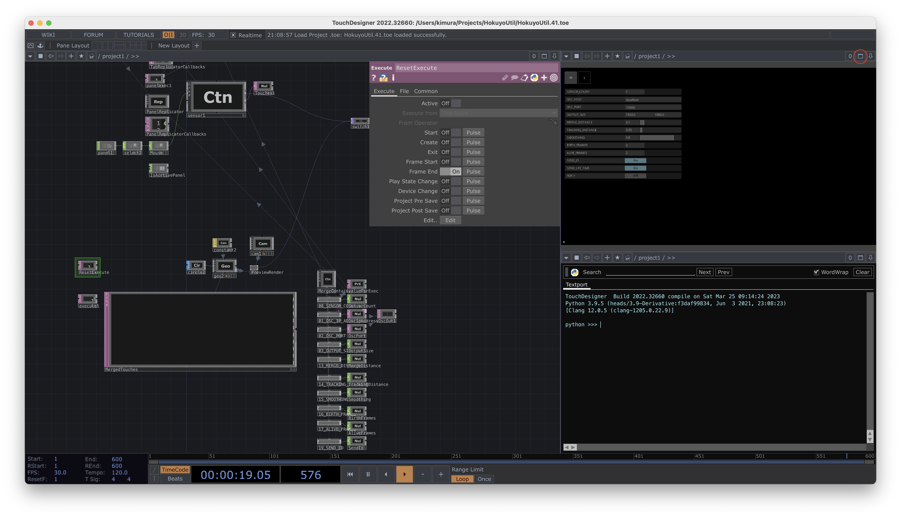
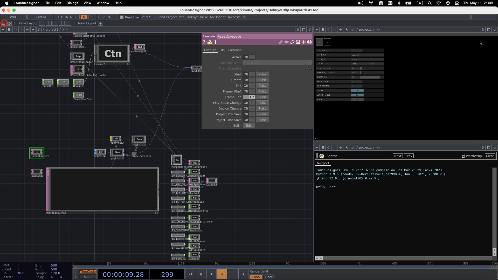
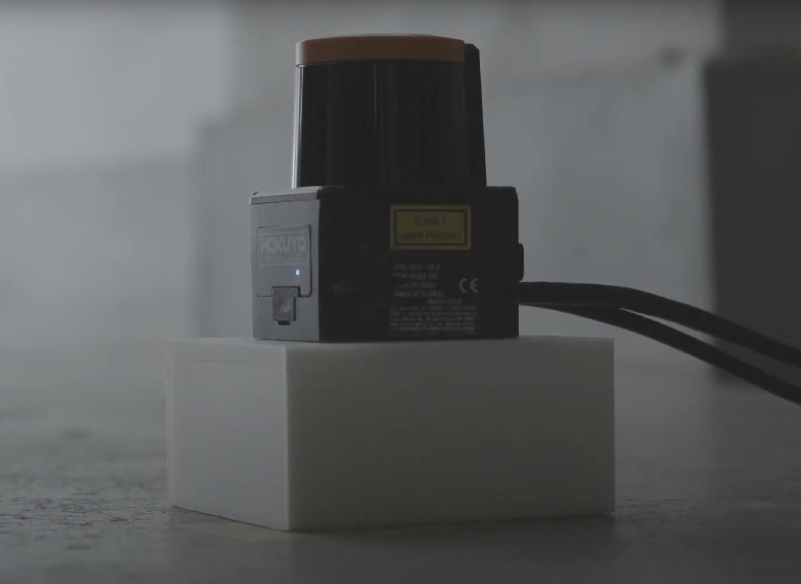
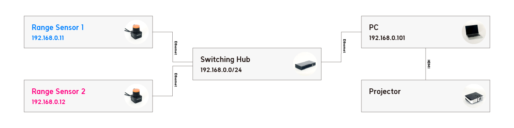
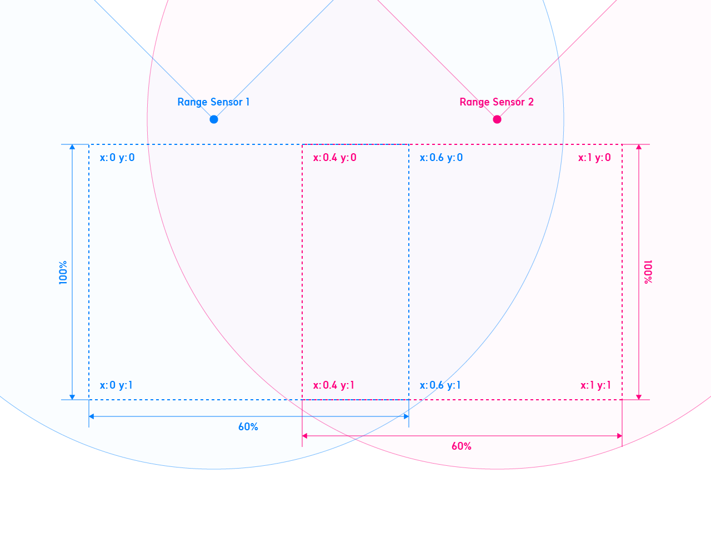

# HokuyoUtil

A tool for a more convenient use of [Hokuyo's scanning rangefinder sensors](https://www.hokuyo-aut.jp/search/?cate01=1), which are widely used for interactive projection.

This sensor can acquire information such as the position of a hand touching a wall or a foot on the floor and its distance and angle from the sensor. HokuyoUtil was developed to simplify the setup and coordinate conversion process.


## Main Features
- Easy setup with GUI
	
	Setup can be done by simply clicking on the 4 points of the rectangular area to be detected
		
- Perspective correction
	
	Correction of any distortion of the rectangle formed by the four vertices due to subtle tilt of the sensor or distortion of the surface on which it is installed.
		
- Merging of data from multiple sensors
	
	Detection of overlapping areas by multiple sensors and merging the data from multiple sensors in order to detect a large area with them.
	
- Tracking
	
	IDs are assigned to each point and the identical ones are tracked.
	Smoothing of the movement of tracked point is also possible.
		
- Output coordinates via [OSC](https://en.wikipedia.org/wiki/Open_Sound_Control)
		
	With the address `/touches`, sets of the x and y values of the points are sent to the specified host and port.
	

## Usage

Tutorial Video: [How to use HokuyoUtil](https://www.youtube.com/watch?v=Xxw_gUPUcy8) (The audio is in Japanese but there is English subtitle)

[](https://youtu.be/Xxw_gUPUcy8)

In the tutorial video, TouchDesigner window is full screen mode. Click the "Fullscreen" button at top right of the window to enter full screen mode.



Use perform mode to reduce machine power in production environments. Click the "Perform Mode" button at top left of the window to enter perform mode.




1. Place the geodesic sensor on the surface where you want to detect touch (it is better to place the sensor 3 to 10 cm away from the surface, as it may not be able to acquire the data correctly due to the tilt of the sensor or distortion of the surface).
	

2. Connect a PC to the same network as the IP address of the sensor (default is 192.168.0.10/24).
	
	network figure in the video example.
3. In the "M" tab of HokuyoUtil, enter the number of sensors to be used in SENSOR_COUNT.
4. In the "1" tab of HokuyoUtil, enter the IP address of the sensor (if it is working correctly, it will show the points acquired by the sensor)
5. Touch the top left vertex of the rectangular area you want to detect to see which part of the screen is the touched position
6. Turn on the LEFT_TOP button, then click on the touched area on the screen (a green dot will appear where you clicked).
7. Set the 3 other vertices following the same process.
8. If you are using multiple sensors, set them up in the same way.
9. In the "M" tab, enter the host and port to send the OSC and the detected coordinates will be sent
10. Save the TouchDesigner file to save the settings


## About the value sent via OSC

The data sent via OSC has the address "/touches" and the data is a Float type array. The first number is TouchDesigner’s elapsed frames, the ones after that are x and y values of the number of touched points. If SEND_ID is turned on or SEND_SIZE is set to ON, those data will also be sent.

## Merge settings

To merge data from multiple touched points located close together or from multiple sensors into a single point, adjust MERGE_DISTANCE in the "M" tab. Points that are closer to each other than the value set here will be merged.
If it is set to 0, they will not be merged at all. The maximum value is 1 and is specified as a percentage of the screen width.
For example, if OUTPUT_SIZE X is 1920 and MERGE_DISTANCE is 0.1, touch points within 192 (1920 * 0.1) of each other will be merged into one point.
When sensing a person walking, the number of points changes as the person's legs become two or overlap one another. If you want to treat this as a single point, adjust this value so that the touch point becomes one when the person stands with their feet as wide as their stride.

## Tracking settings

To track the detected touch point, adjust TRACKING_DISTANCE in the "M" tab. Compared to the previous frame, points that are closer in distance than the value set here will be considered the same touch point and given the same ID.
If set to 0, they will not be tracked. The maximum value is 1 and is specified as a percentage of the screen width.

### SMOOTHING

If SMOOTHING is set to a value greater than 0, the difference from the previous frame is smoothed to smooth the movement of the point being tracked.

### BIRTH_FRAMES / KEEPALIVE_FRAMES

There are cases where new points may appear only momentarily due to noise, etc., or where the tracked points are lost. To deal with these cases, set BIRTH_FRAMES to a value greater than 0, so that a new point is not considered a valid point until it has been tracked for the specified number of consecutive frames. Similarly, setting KEEP_ALIVE_FRAMES to a value greater than 0 will keep the ID and coordinates of a lost point for the number of frames specified here.


## User Interface

The tabs "M" and "1" in the upper left corner switch to the main screen. The number of sensors can be changed  in the settings of the main screen (SENSOR_COUNT).

## Sensor setting panel

### HOKUYO SETTINGS

Sensor’s active status and IP address settings

### VIEW

Adjust the position and zoom of the preview screen.

### LEFT_TOP / RIGHT_TOP / RIGHT_BOTTOM / LEFT_BOTTOM

Specify the point that will be the top left / top right / bottom right / bottom left of the output coordinates

Click to turn it "ON" and then click on the right side of the screen to display a colored point at the clicked position, which will become the vertex of the rectangle of the output coordinates.

### OUTPUT_POSITION (X,Y)

Sensor coverage when multiple sensors are used to cover a large area(0-1).

For example, if two sensors are used to cover each 60% of the left and right rectangle area, set the X values of RIGHT_TOP and RIGHT_BOTTOM to 0.6 for the first sensor, and set the X values of LEFT_TOP and LEFT_BOTTOM to 0.4 for the second sensor. Those coordinates will eventually be merged and output as data from multiple units within the OUTPUT_SIZE range set on the main panel.
	

## Main Panel

### SENSOR_COUNT

Number of sensors

If you use multiple sensors, enter the number here (up to 4)

### OSC_HOST

Host name to which OSC is sent.

### OSC_PORT

Destination port of OSC

### OUTPUT_SIZE (X,Y)

Width and height of the rectangle that will output coordinates.

For example, setting X to 1920 and Y to 1080 will send Full-HD size pixel values.

### MERGE_DISTANCE (0-1)

Distance threshold for merging multiple coordinates into one.

This is a number normalized to the width of the rectangle as 1. Coordinates with a distance less than this threshold are merged into one and the coordinates of the midpoint are output.

This is useful when the number of coordinates increases or decreases due to the overlap of two legs, such as a person walking, or when multiple sensors are used.

When multiple sensors are used, setting this value to zero will cause the number of sensors to be output even if only one point is detected.

### TRACKING_DISTANCE (0-1)

Threshold value of distance from the previous frame to be the same ID when tracking and assigning ID.

If the difference of distance from the previous frame is smaller than this threshold, it is tracked as the same ID. (Disabled if SEND_ID is OFF)

### SMOOTHING (0-1)

To smooth the movement of coordinates with the same ID.

Smoothes the difference from the previous frame to smooth the movement of the tracked points.

### BIRTH_FRAMES

Number of frames from the appearance of a new coordinate to the time when it is considered a valid point.

This is useful to prevent a point appearing only one frame due to noise, or a walking person's foot becoming two points for a moment. (Disabled if SEND_ID is OFF.)

### ALIVE_FRAMES

Number of frames between the disappearance of ID-assigned coordinates during tracking and the actual deletion of the coordinates.

This is useful to prevent tracking from continuing and assigning another ID when only one frame disappears due to noise, or when a running person's feet float in the air and disappear for a moment. (Disabled if SEND_ID is OFF)


### SEND_ID

Whether ID is sent or not.

### SEND_LIFE_TIME

Whether to send number of elapsed frames since the point has been detected first time.

### FLIP_Y

Whether Y coordinate is flipped or not.

## Examples

This repository includes electron example (/examples/electron).
Run the command below to run the electron example. (node.js is required)
```sh
yarn install
yarn dev
```


## Case Examples
- [Summer Sonic 2023 Interactive Sequencer](https://vimeo.com/818967050)
- [Moji Mikke](https://vimeo.com/816796218/902f21cfe6)
